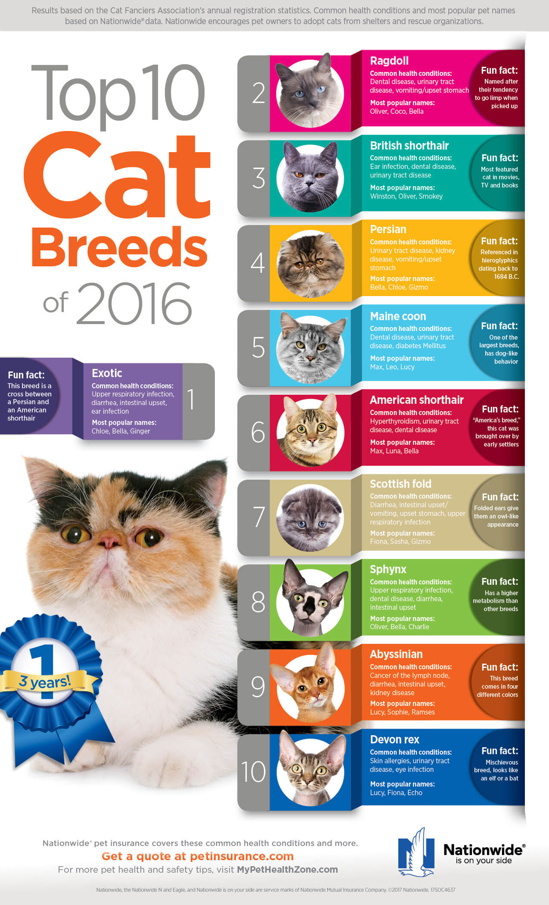

 

# Top 10 Cat Breeds

  <a href="#overview">Overview</a> •
  <a href="#data-rights">Data Rights</a>

 

## Overview 

Project with 10 images - most popular types of cats of 2016 (one image for every breed). Also project contains 10  tags - names of the breeds. Tags are asiigned to corresponding images.

    
    <em>Image credit: <a href="https://www.petinsurance.com/healthzone/pet-breeds/cat-breeds/lifestyle-cat-breeds/top-10-cat-breeds-infographic/">link</a></em>

## Data Rights
Images for this demo project were obtained from the [www.petinsurance.com](https://www.petinsurance.com/healthzone/pet-breeds/cat-breeds/lifestyle-cat-breeds/top-10-cat-breeds/) website. Use of these images must respect the corresponding terms of use.

